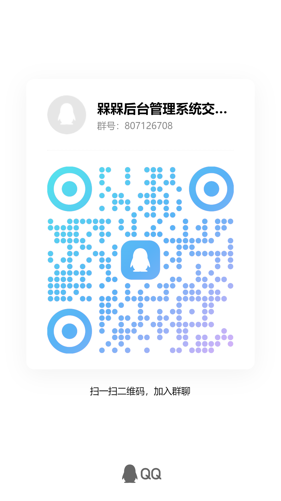

## 项目简介
槑槑是一款后台管理系统，它前端基于 [vue](https://cn.vuejs.org/) 和 [element-ui](https://element.eleme.cn/#/zh-CN) ，后端基于 node 的后端框架 [nestjs](https://docs.nestjs.cn/8/) ，数据库采用 mysql ，缓存采用 redis。

该版本从 [4e71788999965e325ba1f5545a663869be222664](https://github.com/87789771/meimei-nestjs-admin/commit/4e71788999965e325ba1f5545a663869be222664) 抽取出来，后续由 [SunSeekerX](https://github.com/SunSeekerX) 维护，随缘修改，不建议用在生产环境。

相对于 meimei-prisma-vue3 区别

- 更加激进的版本更新策略，依赖最新版本
- 使用 dotenv 进行环境变量配置

QQ 交流群 807126708

点击链接加入群聊【槑槑后台管理系统交流群】：https://qm.qq.com/q/mAVhtnp4Oe



微信交流群：请添加微信 finwiz 邀请进群

## 在线演示

https://meimei.yoouu.cn/

admin

admin123

https://meimei-doc.yoouu.cn/swagger-ui

## 开发部署

### 开发

依赖 docker 开发环境，使用 docker 启动 mysql 和 redis，当然你有配置好的数据库和 redis 也可以

```shell
# 停止开发环境
docker-compose down
# 启动开发环境
docker-compose up -d
# 访问 http://localhost:8080/ 找到 meimei 数据库导入 meimei_server 下面的 init.sql 文件
```

进入 meimei_server

```shell
# 安装依赖
yarn
# 启动 
yarn dev
```

进入 meimei_ui_vue3

```shell
# 安装依赖
yarn
# 启动 
yarn dev
```

访问 localhost

### 部署

确保 .env.production 存在，配置没问题，跟开发差不多。

### nginx 规则

后台管理面板 api 反向代理，13000 是你启动的 server 端的端口

```nginx
location /prod-api/ {
        proxy_pass http://localhost:13000/api/;
        proxy_set_header Host $host;
        proxy_set_header X-Real-IP $remote_addr;
        proxy_set_header X-Forwarded-For $proxy_add_x_forwarded_for;
    }
```

后台管理面板伪静态规则

```nginx
location / {
  try_files $uri $uri/ /index.html;
}
```


## 技术要求
  - [Vue](https://cn.vuejs.org/)
  - [Element-ui](https://element.eleme.cn/#/zh-CN)
  - [TypeScript](https://www.tslang.cn/index.html)
  - [Nestjs](https://docs.nestjs.cn/8/)
  - [TypeORM](https://typeorm.biunav.com/)
  - Mysql
  - Redis

## 技术选型
  1. **前端技术**
   - vue @2.6.12
   - element-ui @2.15.6
   - axios @0.24.0
   - vuex @3.6.0
   - vue-router @3.4.9
   - sass-loader @10.1.1

  2. **后端技术**
   - nest @8.0
   - mysql2 @2.3.3
   - swagger-ui-express @4.2.0
   - typeorm @0.2.41
   - ioredis @4.28.2

## 内置功能
- 用户管理：用户是系统操作者，该功能主要完成系统用户配置。
- 部门管理：配置系统组织机构（公司、部门、小组），树结构展现支持数据权限。
- 岗位管理：配置系统用户所属担任职务。
- 菜单管理：配置系统菜单，操作权限，按钮权限标识等。
- 角色管理：角色菜单权限分配、设置角色按机构进行数据范围权限划分。
- 字典管理：对系统中经常使用的一些较为固定的数据进行维护。
- 参数管理：对系统动态配置常用参数。
- 通知公告：系统通知公告信息发布维护。
- 操作日志：系统正常操作日志记录和查询；系统异常信息日志记录和查询。
- 登录日志：系统登录日志记录查询包含登录异常。
- 在线用户：当前系统中活跃用户状态监控。
- 定时任务：在线（添加、修改、删除)任务调度包含执行结果日志。
- 系统接口：根据业务代码自动生成相关的api接口文档。
- 服务监控：监视当前系统CPU、内存、磁盘、堆栈等相关信息。
- 在线构建器：拖动表单元素生成相应的Vue代码。


## 目录结构

```
    meimei
    ├── public #静态文件
    │   └── upload                      #上传文件夹
    ├── src
    │   ├── common                      
    │   │   ├── class                   #公共返回值包装类
    │   │   ├── contants                #系统常量
    │   │   ├── decorators              #装饰器
    │   │   ├── dto                     #数据模型
    │   │   ├── entities                #公共实体模型
    │   │   ├── enums                   #枚举
    │   │   ├── exceptions              #全局错误拦截器
    │   │   ├── filters                 #全局错误过滤器
    │   │   ├── guards                  #全局守卫
    │   │   ├── interceptors            #装饰器
    │   │   ├── interface               #公共接口
    │   │   └── pipes                   #公共管道
    │   ├── config
    │   │   ├── config.development.ts   #开发环境配置文件
    │   │   ├── config.production.ts    #正式环境配置文件
    │   │   ├── configuration.ts      
    │   │   └── defineConfig.ts
    │   ├── modules                     #业务模块文件夹
    │   │   ├── common                  #导入导出和上传模块
    │   │   ├── login                   #登录模块
    │   │   ├── monitor                 #系统监控
    │   │   └── system                  #系统管理
    │   ├── shared                      #公共模块
    │   │   ├── shared.module.ts
    │   │   └── shared.service.ts       #公共方法
    │   ├── app.module.ts
    │   ├── main.ts
    │   └── setup-swagger.ts
    ├── test
    │   ├── app.e2e-spec.ts
    │   └── jest-e2e.json
    ├── .eslintrc.js
    ├── .prettierrc
    ├── mei-mei.sql                     #初始化sql语句
    ├── nest-cli.json
    ├── package.json
    ├── tsconfig.build.json
    ├── tsconfig.json
    └── yarn.lock
```

## 系统截图
 
 
 
 
 
 
 
 
 
 
 
 